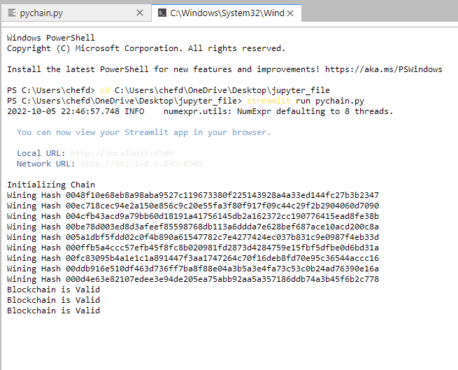
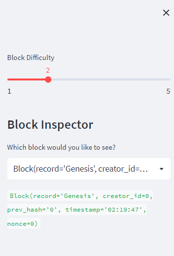
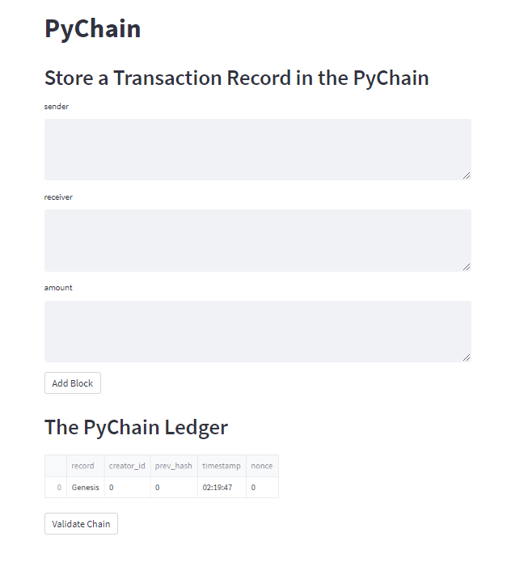
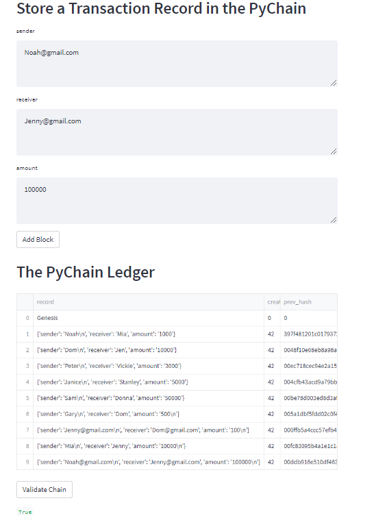
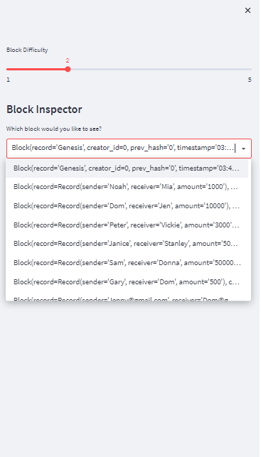

# Unit-18-Homework-PyChain-Ledger

--- 
---

In this Assignment task I had to build a blockchain-based ledger system, complete with a user-friendly web interface. This ledger should allow others to conduct financial transactions (that is, to transfer money between senders and receivers) and to verify the integrity of the data in the ledger.
I had to make the following updates to the provided Python file for this assignment, which already contained the basic PyChain ledger structure that I created throughout the module:

1. I created a new data class named Record. This class served as the blueprint for the financial transaction records that the blocks of the ledger would be stored.

2.  I modified the existing Block data class to store Record data.

3. I added Relevant User Inputs to the Streamlit interface.

4. I tested the PyChain Ledger by Storing Records.

## STEPS
---
` Step 1: `
 - I created a Record Data Class
- Defined a new Python data class named Record. Gave this new class a formalized data structure that consisted of the sender, receiver, and amount attributes.

` Step 2:` 
- I modified the Existing Block Data Class to Store Record Data
- I renamed the data attribute in the Block class to record, and then I set it to use an instance of the new Record class that I created in the previous section. I 

` Step 3: `
- I added Relevant User Inputs to the Streamlit Interface
- I coded additional input areas for the user interface of the Streamlit application. 
- I created these input areas to capture the sender, receiver, and amount for each transaction that I stored in the Block record. 

` Step 4:`
 - I tested the PyChain Ledger by Storing Records
- I tested the complete PyChain ledger and user interface by running the Streamlit application and storing some mined blocks in the PyChain ledger. Then tested the blockchain validation process by using the PyChain ledger. 

- In the terminal, I navigated to the project folder I coded the assignment and ran the Streamlit application by using streamlit run pychain.py.

---
---

## - I entered values for the sender, receiver, and amount, and then clicked the Add Block button. I did this several times to store several blocks in the ledger.

- Verified the block contents and hashes in the Streamlit dropdown menu.

